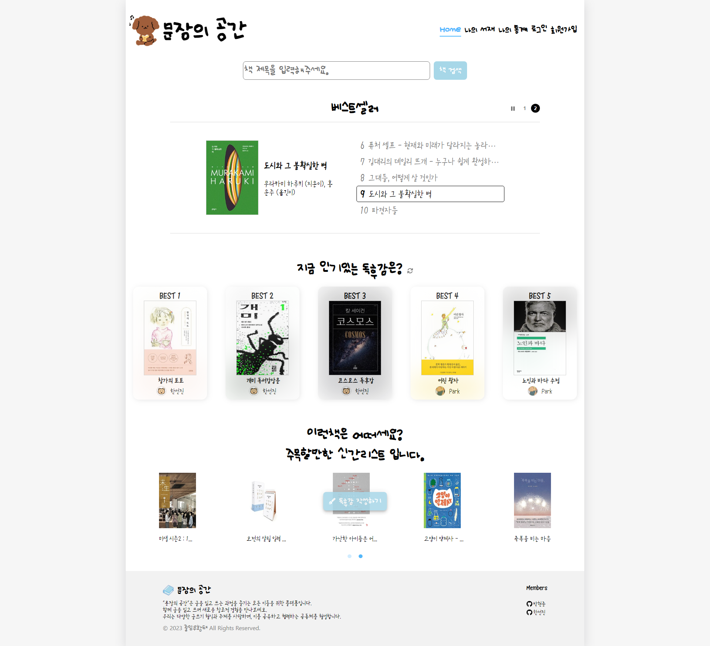
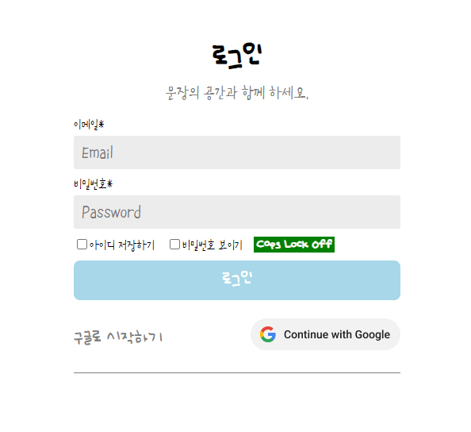
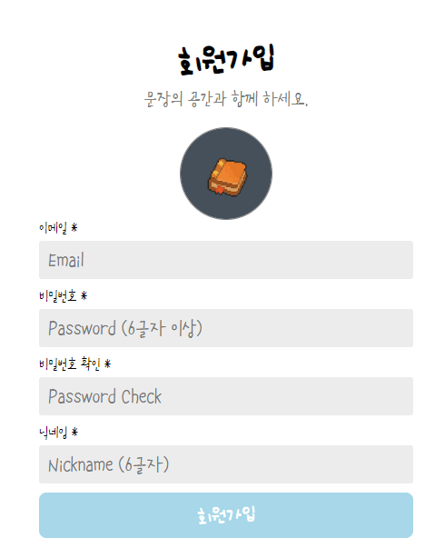

#  문장의 정원

## 프로젝트 소개

- 개발기간 : 2023.09.11 ~ 2023.11.02

- "문장의 공간"은 글을 읽고 쓰는 과정을 즐기는 모든 이들을 위한 플랫폼입니다.
- 개인의 독후감을 공개/비공개로 설정할 수 있으며 다른 사용자의 공개된 독후감을 구경할 수 있습니다.

## 팀 소개

<table>
  <tbody>
    <tr>
      <td align="center">
        <b>박현준(FE)</b>
      </td>
      <td align="center">
        <b>한선진(FE)</b>
      </td>
    </tr>
    <tr>
      <td align="center">
        <a href="https://github.com/DT-HYUNJUN" target="_blank" rel="noreferrer">
          
        </a>
      </td>
      <td align="center">
        <a href="https://github.com/badajinsee" target="_blank" rel="noreferrer">
          
        </a>
      </td>
    </tr>
  </tbody>
</table>

## 개발환경

- Front :     
- Back:  
- 버전 관리 : 
- 협업 툴 :  
- 디자인 참고 :  올리브영, 북적북적, 밀리의 서재, 알라딘

## 역할 분담

📘 박현준

- 페이지 : 홈(베스트 셀러, 인기 독후감), 회원가입, 독후감(상세, 작성, 수정), 통계, 나의 정보, 책 검색 모달

- 기능 : Firebase 기능, carousel 구현,

📕 한선진

- 페이지 : 홈(API 요청, 책 검색), 나의 서재(독후감 리스트), 로그인, 책(상세), 책별 독후감,

- 기능 : 독후감 리스트 필터링, 독후감 삭제

## 프로젝트 구조

```
src
  ├─ App.css
  ├─ App.js
  ├─ fbase.js
  ├─ index.css
  ├─ index.js
  ├─ components
  │  ├─ All.js
  │  ├─ ChangePassword.js
  │  ├─ Modal.js
  │  ├─ Month.js
  │  ├─ MyButton.js
  │  ├─ MyFooter.js
  │  ├─ MyHeader.js
  │  ├─ MyProfile.js
  │  └─ ReportContentList.js
  ├─ pages
  │  ├─ Auth.js
  │  ├─ Book.js
  │  ├─ BookSearch.js
  │  ├─ Edit.js
  │  ├─ Home.js
  │  ├─ List.js
  │  ├─ New.js
  │  ├─ Profile.js
  │  ├─ Report.js
  │  ├─ SignUp.js
  │  ├─ Statistics.js
  │  └─ ThisBookReport.js
  └─ utils
     ├─ getBooks.js
     ├─ getDefaultProfileImage.js
     ├─ getLikeReports.js
     ├─ listBooks.js
     ├─ newSpecialBook.js
     ├─ uploadProfileImage.js
     └─ useInterval.js
```

## 페이지 기능

- ### [홈]



#### 베스트 셀러 carousel


- ### [로그인 / 회원가입]





- ### [독후감 작성]


- ### [나의 서재]


- ### [나의 통계]


- ### [책 상세]


